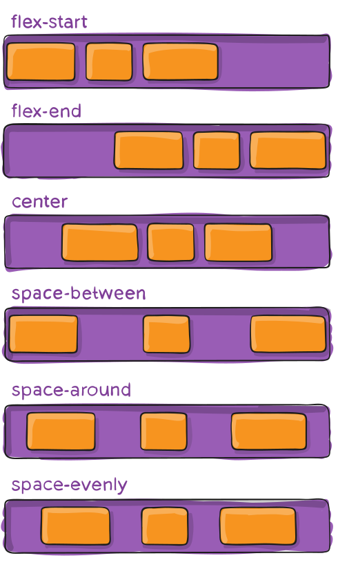

# HTML
## Структура документа :
``` html
   - <html>: Это корневой тег, который обозначает начало и конец HTML-документа.
   - <head>: Этот тег содержит информацию о документе, такую как название, метаданные и ссылки на внешние ресурсы, такие как стили CSS и скрипты JavaScript.
   - <body>: Этот тег содержит весь видимый контент страницы, такой как заголовки, параграфы, изображения, ссылки и т.д.
```
``` html
<!DOCTYPE html>
<html>
<head>
  <title>Моя веб-страница</title>
</head>
<body>
  <h1>Добро пожаловать на мою веб-страницу!</h1>
  <p>Это мой первый HTML-документ.</p>
</body>
</html>
```
## Базовые теги :
``` html
   - <h1>, <h2>, <h3>, <h4>, <h5>, <h6>: Заголовки от самого большого (h1) до самого маленького (h6).
   - <p>: Используется для создания абзацев текста.
   - <a>: Создает гиперссылку, которая может вести на другую страницу, раздел этой же страницы или другой ресурс.
   - : Вставляет изображение на страницу.
   - <ul> и <ol>: Используются для создания ненумерованных (ul) и нумерованных (ol) списков.
   - <div>: Универсальный контейнерный тег, используемый для группировки элементов и применения стилей.
```
``` html
<h1>Заголовок первого уровня</h1>
<p>Это абзац текста.</p>
<a href="https://www.example.com">Ссылка на другую страницу</a>

<ul>
  <li>Элемент 1</li>
  <li>Элемент 2</li>
  <li>Элемент 3</li>
</ul>
<ol>
  <li>Первый элемент</li>
  <li>Второй элемент</li>
  <li>Третий элемент</li>
</ol>
<div>
  <p>Этот текст находится внутри div-контейнера.</p>
</div>
```
## Атрибуты тегов :
``` html
   - href: Используется в теге <a> для указания адреса ссылки.
   - src: Используется в теге  для указания пути к изображению.
   - id: Уникальный идентификатор элемента, который может использоваться для стилизации или JavaScript-манипуляций.
   - class: Позволяет группировать элементы по классам для последующей стилизации.
```
``` html
<a href="https://www.example.com" target="_blank">Ссылка на другую страницу</a>

<div id="my-div" class="container">Этот div имеет уникальный ID и класс</div>
```
## Семантические теги:
``` html
   - <header>: Обозначает заголовочную часть страницы или раздела.
   - <nav>: Используется для создания навигационного меню.
   - <main>: Определяет основное содержимое страницы.
   - <section>: Обозначает тематический раздел страницы.
   - <article>: Используется для обозначения самостоятельного, независимого контента.
   - <footer>: Обозначает нижнюю часть страницы или раздела.
```

``` html
<header>
  <nav>
    <ul>
      <li><a href="#">Главная</a></li>
      <li><a href="#">О нас</a></li>
      <li><a href="#">Услуги</a></li>
      <li><a href="#">Контакты</a></li>
    </ul>
  </nav>
</header>

<main>
  <section>
    <h2>Добро пожаловать на наш сайт</h2>
    <p>Здесь вы найдете информацию о нашей компании и предоставляемых услугах.</p>
  </section>

  <article>
    <h2>Наши услуги</h2>
    <ul>
      <li>Услуга 1</li>
      <li>Услуга 2</li>
      <li>Услуга 3</li>
    </ul>
  </article>
</main>

<footer>
  <p>&copy; 2024 Мой сайт. Все права защищены.</p>
</footer>
```
# Синтаксис CSS (селекторы, свойства, значения):
   - Селекторы используются для выбора элементов, к которым будут применены стили.
   - Свойства определяют, какие характеристики элемента будут изменены (цвет, размер, расположение и т.д.).
   - Значения определяют, как будут применены стили к выбранным элементам.

Пример:
``` css
/* Селектор тега */
h1 {
  color: blue;
  font-size: 32px;
}

/* Селектор класса */
.my-class {
  background-color: #f0f0f0;
  padding: 20px;
}

/* Селектор ID */
#my-id {
  text-align: center;
  font-weight: bold;
}

/* Комбинированный селектор */
header nav ul li a {
  text-decoration: none;
  color: #333;
}
```
## Каскадность и наследование:
   - Каскадность определяет, какие стили будут применены, если для одного элемента определено несколько правил.
   - Наследование позволяет дочерним элементам наследовать свойства от родительских элементов.

``` css
/* Более специфичный селектор перекрывает менее специфичный */
p {
  color: black;
}

.my-paragraph {
  color: blue;
}

/* Дочерний элемент наследует свойство цвета от родительского */
body {
  color: #333;
}

p {
  /* Наследует цвет #333 от body */
}
```
## Способы применения CSS (внутренние, внешние стили, встроенные):
``` html
   - Внутренние стили: Определяются в <style> теге внутри <head> раздела HTML-документа.
   - Внешние стили: Хранятся в отдельном CSS-файле, на который ссылается HTML-документ с помощью <link> тега.
   - Встроенные стили: Применяются непосредственно к элементам HTML с помощью атрибута style.
```

``` html
<!-- Внутренние стили -->
<head>
  <style>
    h1 {
      color: red;
    }
  </style>
</head>

<!-- Внешние стили -->
<head>
  <link rel="stylesheet" href="styles.css">
</head>

<!-- Встроенные стили -->
<h1 style="color: blue;">Заголовок</h1>
```
## Основные свойства (цвет, фон, шрифт, размеры, положение, отступы и т.д.):
   - Цвет: color, background-color
   - Шрифт: font-family, font-size, font-weight, font-style
   - Размеры: width, height, max-width, max-height
   - Положение: position, top, right, bottom, left
   - Отступы: margin, padding

Пример:
``` css
body {
  font-family: Arial, sans-serif;
  color: #333;
  background-color: #f0f0f0;
}

h1 {
  font-size: 36px;
  font-weight: bold;
  color: #0077b6;
  margin-top: 40px;
  margin-bottom: 20px;
}

p {
  font-size: 16px;
  line-height: 1.5;
  margin-bottom: 16px;
}

img {
  max-width: 100%;
  height: auto;
  display: block;
  margin: 20px auto;
}
```
## Блочная модель (margin, border, padding, content):
   - Margin: Внешний отступ, который создает пространство вокруг элемента.
   - Border: Граница, которая обрамляет элемент.
   - Padding: Внутренний отступ, который создает пространство между контентом и границей.
   - Content: Содержимое элемента.

``` css
div {
  width: 300px;
  height: 200px;
  background-color: #f0f0f0;
  border: 1px solid #ccc;
  padding: 20px;
  margin: 40px;
}
```
## Flexbox (расположение элементов):
Флекс это не просто свойство css, это настоящий флекс. Благодаря этому набору правил получится практически как угодно располагать элементы на странице, выравнивать, загонять и прижимать.

### Свойства флекс-контейнера

#### display

Данное свойство определяет флекс-контейнер; блочный или строчный в зависимости от присвоенного значения. Оно включает «флекс-контекст» для всех прямых потомков контейнера.
``` css
.container {
  display: flex; /* или inline-flex */
}
```

#### flex-direction (направление)


Данное свойство определяет основную ось, направление, по которому размещаются элементы в контейнере. Флекс сам по себе (без расширяющих его функционал оберток) реализует концепцию однонаправленного макета. Поэтому элементы размещаются либо в горизональных строках, либо в вертикальных колонках.
``` css
.container {
  flex-direction: row | row-reverse | column | column-reverse;
}
```
``` css
row: элементы располагаются слева направо в ltr или справа налево в rtl
row-reverse: обратный row порядок расположения элементов — справа налево в ltr или слева направо в rtl
column: аналогично row, но сверху вниз
column-reverse: аналогично row-reverse, но снизу вверх
```

#### flex-wrap (перенос, переход, разделение)


По умолчанию, все элементы помещаются в одну строку. С помощью данного свойства можно позволить элементам перемещаться на следующую строку при необходимости.
``` css
.container {
  flex-wrap: nowrap | wrap | wrap-reverse;
}
```
``` css
nowrap: все элементы располагаются на одной строке
wrap: элементы могут располагаться на нескольких строках сверху вниз
wrap-reverse: элементы могут располагаться на нескольких строках снизу вверх
```
#### flex-flow (поток)

Данное свойство является сокращением для flex-direction и flex-wrap, которые определяют основную и поперечную оси контейнера. Значением по умолчанию является row nowrap.
``` css
.container {
  flex-flow: column wrap;
}
```
#### justify-content (выравнивание контента в одной строке)



Данное свойство определяет выравнивание элементов вдоль основной оси. Оно позволяет распределять свободное пространство, оставшееся неиспользованным элементами с фиксированным размером или гибкими элементами, достигшими максимального размера. Оно также позволяет управлять выравниванием при переполнении строки элементами.
``` css
.container {
  justify-content: flex-start | flex-end | center | space-between | space-around | space-evenly | start | end | left | right ... + safe | unsafe;
}
```

``` css
flex-start: элементы сдвигаются в начало контейнера вдоль основной оси
flex-end: элементы сдвигаются в конец контейнера
start: элементы сдвигаются в начало контейнера, определяемое значением свойства «writing-mode» (направление письма)
end: элементы сдвигаются в конец контейнера, определяемый значением свойства «writing-mode»
left: элементы прижимаются к левому краю контейнера; без flex-direction поведение аналогично start
right: элементы прижимаются к правому краю контейнера; без flex-direction поведение аналогично start
center: элементы выравниваются по центру
space-between: элементы выравниваются таким образом, что первый элемент находится в начале строки, последний — в конце, а остальные элементы равномерно распределяются по оставшемуся пространству
space-around: элементы равномерно распределяются с одинаковым пространством по краям. Обратите внимание, что визуально пространство между элементами и краями контейнера не является одинаковым; это объясняется тем, что элементы занимают определенное пространство по обеим сторонам. Первый элемент занимает одну часть пространства от края контейнера, но две части до второго элемента, поскольку второй элемент также занимает одну часть пространства со стороны первого элемента
space-evenly: элементы размещаются таким образом, чтобы пространство между любыми двумя элементами являлось одинаковым
```
#### align-items (выравнивание элементов)


Данное свойство определяет, как элементы располагаются вдоль поперечной оси. Его можно сравнить с justify-content применительно к поперечной оси (перпендикулярной основной).
``` css
.container {
  align-items: stretch | flex-start | flex-end | center | baseline | first baseline | last baseline | start | end | self-start | self-end + ... safe | unsafe;
}
```
``` css
stretch: элементы растягиваются, чтобы заполнить весь контейнер (зависит от их min-width/max-width)
flex-start / start / self-start: элементы смещаются к началу поперечной оси. Различия между указанными свойствами несущественны и зависят от flex-direction или writing-mode
flex-end / end / self-end: элементы смещаются в конец поперечной оси. Различия между указанными свойствами несущественны и зависят от flex-direction или writing-mode
center: элементы выравниваются по центру
baseline: элементы выравниваются вдоль их основной линии
```
#### align-content (выравнивание содержимого в нескольких строках)


Данное свойство определяет выравнивание строк контейнера при наличии свободного пространство вдоль поперечной оси. Оно похоже на justify-content, которое распределяет пространство между отдельными элементами вдоль основной оси.
``` css
.container {
  align-content: flex-start | flex-end | center | space-between | space-around | space-evenly | stretch | start | end | baseline | first baseline | last baseline + ... safe | unsafe;
}
```
``` css
normal: строки находится на обычных позициях
flex-start / start: строки сдвигаются в начало контейнера. flex-start зависит от flex-direction, а start — от writing-mode
flex-end / end: строки сдвигаются в конец контейнера. flex-end зависит от flex-direction, а end — от writing-mode
center: строки выравниваются по центру
space-between: строки располагаются таким образом, что первая строка находится в начале контейнера, последняя — в конце, а остальные строки распределяются равномерно
space-around: строки располагаются с одинаковым пространством между ними
space-evenly: строки располагаются с одинаковым пространством вокруг каждой из них
stretch: строки растягиваются, занимая все доступное пространство
```
### Свойства флекс-элементов


#### order (порядок)


По умолчанию, элементы располагаются в контейнере в том порядке, в котором указаны в разметке. Данное свойство позволяет этим управлять.
``` css
.item {
  order: 5; /* по умолчанию равняется 0 */
}
```
#### flex-grow (рост, расширение)


Данное свойство определяет способность элемента к расширению при необходимости. Оно принимает целочисленное значение, которое выступает в качестве пропорции. Пропорция определяет, какое количество доступного пространства в контейнере может занимать элемент.

Если все элементы имеют свойство «flex-grow» со значением 1, доступное пространство будет между ними распределяться равномерно. Если значением flex-grow одного из элементов является 2, данный элемент будет занимать двойную порцию пространства по сравнению с остальными элементами (или, по крайней мере, попытается это сделать).
``` css
.item {
  flex-grow: 4; /* по умолчанию 0 */
}
```
Отрицательные значения невалидны.

#### flex-shrink (сжатие, сокращение)

Данное свойство определяет способность элемента к сжатию при необходимости.
``` css
.item {
  flex-shrink: 3; /* по умолчанию 1 */
}
```
Отрицательные значения невалидны.

#### flex-basis

Данное свойство определяет стандартный размер элемента перед распределением оставшегося пространства. Этим размером может быть длина (например, 20%, 5rem и т.д.) или ключевое слово. Ключевое слово «auto» означает использование значения свойства «width» или «height» элемента (раньше вместо auto использовалось main-size). Ключевое слово «content» означает учет содержимого элемента. Указанное ключевое слово пока плохо поддерживается, поэтому сложно определить разницу между min-content, max-content и fit-content.
``` css
.item {
  flex-basis:  | auto; /* по умолчанию auto */
}
```
Если значением этого свойства является 0, окружающее элемента пространство не принимается в расчет. Если значением является «auto», доступное пространство распределяется согласно значению свойства «flex-grow».

### flex

Данное свойство является сокращением для flex-grow, flex-shrink и flex-basis. Второй и третий параметры (flex-shrink и flex-basis) являются опциональными. Значением по умолчанию является 0 1 auto, при этом auto можно опустить.
``` css
.item {
  flex: none | [ <'flex-grow'> <'flex-shrink'>? || <'flex-basis'> ]
}
```

#### align-self(выравнивание отдельного элемента)


Данное свойство позволяет перезаписывать дефолтное или установленное с помощью align-self выравнивание отдельного элемента.

``` css
.item {
  align-self: auto | flex-start | flex-end | center | baseline | stretch;
}
```
Обратите внимание, что float, clear и vertical-align применительно к флекс-элементу не имеют никакого эффекта.

Примеры использования

``` css
.parent {
  display: flex;
  height: 300px; /* Или любое другое значение */
}

.child {
  width: 100px;  /* Или любое другое значение */
  height: 100px; /* Или любое другое значение */
  margin: auto;  /* Волшебство! */
}
```
Это работает благодарю тому, что свойство «margin» со значением «auto» поглащает все доступное пространство флекс-контейнера. Поэтому установка значения вертикальных внешних отступов в auto приводит к идеальному центрированию элемента по обеим осям.

Теперь попробуем использовать больше свойств. У нас имеется 6 элементов фиксированного размера, способных перестраиваться в зависимости от ширины экрана без участия медиа-запросов. Мы хотим, чтобы доступное пространство основной оси распределялось между элементами равномерно.
``` css
.flex-container {
  /* Сначала мы создаем контекст флекс-макета */
  display: flex;

  /* Затем мы определяем направление потока,
    позволяя элементам переходить на следующую строку при необходимости
   * Указанное свойство и его значения аналогичны следующему:
   * flex-direction: row;
   * flex-wrap: wrap;
   */
  flex-flow: row wrap;

  /* Наконец, мы определяем, как должно распределяться оставшееся пространство */
  justify-content: space-around;
}
```

## Свойство position
По своей сути то и значит - как элемент себя позиционирует
``` css
static: Элемент располагается в нормальном потоке документа. Значение top, right, bottom и left не влияют на положение элемента.
relative: Элемент позиционируется относительно своего обычного места в потоке. Значения top, right, bottom и left определяют смещение элемента от его обычного положения.
absolute: Элемент позиционируется относительно ближайшего позиционированного предка (элемент с position не равным static). Если такого предка нет, то относительно документа.
fixed: Элемент позиционируется относительно viewport, то есть окна браузера. Он остается на том же месте даже при прокрутке страницы.
sticky: Элемент ведет себя как relative, пока не достигает определенной точки в viewport, после чего ведет себя как fixed.
```
Пример:
``` css
.element {
  position: absolute;
  top: 20px;
  right: 30px;
}
```

## Псевдоселекторы:
Крайне важные штуки. 
Имеют синтаксис название класса\селектор : псевдоселектор { свойства }
``` css
   - :hover: Применяется к элементу при наведении на него курсора мыши.
   - :active: Применяется к элементу, когда на него нажимают.
   - :focus: Применяется к элементу, когда он получает фокус (например, при клике на поле ввода).
   - :visited: Применяется к ссылке, которую пользователь уже посещал.
   - :first-child: Применяется к первому дочернему элементу родителя.
   - :last-child: Применяется к последнему дочернему элементу родителя.
   - :nth-child(n): Применяется к n-му дочернему элементу родителя.
   - :before и :after: Используются для создания псевдоэлементов, которые являются частью элемента, но не входят в его основное содержимое.
```

Пример:
``` css
a:hover {
  color: blue;
}

button:active {
  transform: scale(0.95);
}

input:focus {
  outline: none;
  box-shadow: 0 0 5px rgba(0, 0, 0, 0.3);
}

li:nth-child(odd) {
  background-color: #f0f0f0;
}

.element:before {
  content: "Перед элементом";
  display: block;
  margin-bottom: 10px;
}
```

# Советы начинающим верстальщикам
#### Вы никогда не сможете нормально верстать, если не будете пробовать. Увидели новое свойтво - используйте его. Не поняли что делает свойство position: absolute - гуглите и сами пробуйте верстать.

#### Используйте инспектор объектов

хочешь узнать что за цвет на кнопке?
нажимаешь на правую кнопку мыши и посмотреть код элементов или нажимаешь cltr+shift+c

Ты получишь такую консоль, где нажав на указатель слева 
сможешь выбрать нужный элемент и та-да, ты имеешь все его свойства

Также если забыл flex свойства тут ты можешь настроить так, как тебе хочется, сразу видя результат, и потом перенести это себе в код


#### Советую, если заинтересовались css, прочитать книгу css для профи(css in deep) Кила Гранта, благодаря книге вы всего за 500 страниц станете максимально разбираться в css и с маленьким практическим опытом сможете верстать по-истенне хорошие макеты