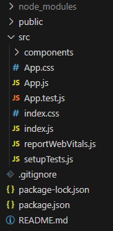
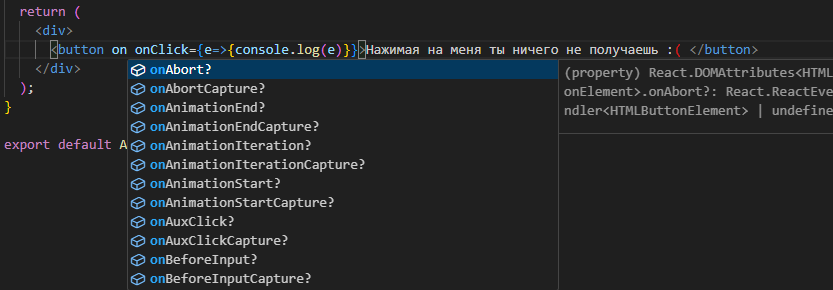
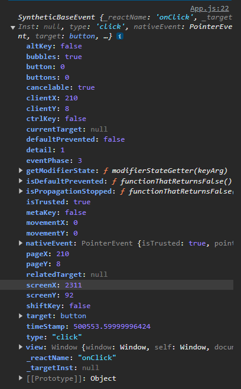
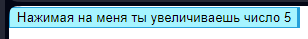
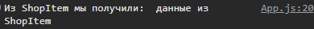
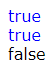
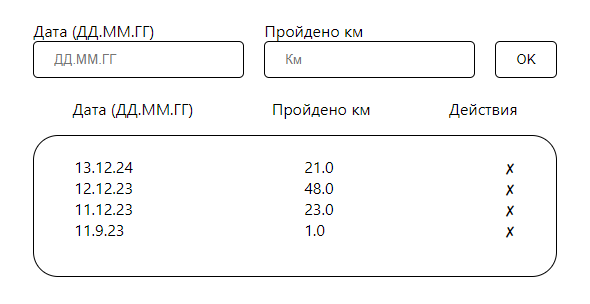
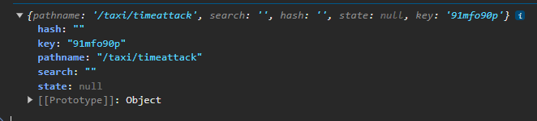
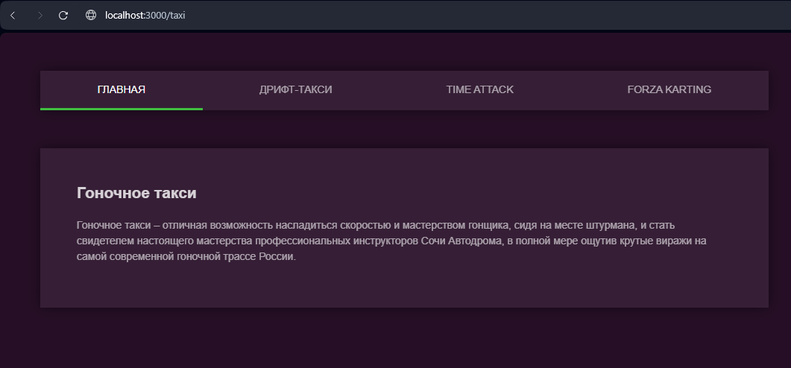
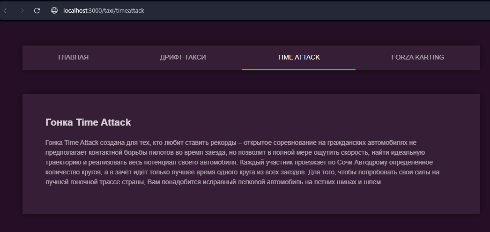

# Введение в React.js

## Что такое React.js?

React.js — это библиотека JavaScript для создания пользовательских интерфейсов, разработанная Facebook. Она позволяет разработчикам создавать многоразовые компоненты, которые могут управлять своим состоянием и эффективно обновлять интерфейс при изменении данных. React использует виртуальный DOM, что обеспечивает высокую производительность при обновлении интерфейса.

## Основные особенности React.js:

- **Компонентная архитектура**: React позволяет разбивать интерфейс на независимые компоненты, что упрощает разработку и повторное использование кода.

- **Однонаправленный поток данных**: Данные в React передаются сверху вниз, что облегчает понимание структуры приложения и управление состоянием.

- **Хуки**: React предоставляет хуки, которые позволяют использовать состояние и другие функции без написания классов.

- **Виртуальный DOM**: React создает виртуальное представление DOM, что позволяет минимизировать количество операций с реальным DOM и улучшить производительность.

## Установка React приложения

Для начала работы с React необходимо установить Node.js и npm. После установки можно создать новое React приложение с помощью Create React App или с помощью тулинга Vite.  

1. Установите Node.js с [официального сайта](https://nodejs.org/en).
2. Откройте терминал и выполните команду:
Create React App:
```bash
   npx create-react-app project-name
```
После, для перехода в эту папку, прописывайте 
``` bash
  cd project-name
```
Для установки всех зависимостей и создания папки node_modules - откуда будут браться все функции и объекты, необходимые для разработки
 ``` bash
  npm install
```
И наконец для запуска вашего проекта react на сайте
``` bash
  npm run start
```
Vite
```bash
  npm  create vite my-app --template react
```
или
```bash
  yarn create vite my-app --template react
```

После, для перехода в эту папку, прописывайте 
``` bash
  cd project-name
```
Для установки всех зависимостей и создания папки node_modules - откуда будут браться все функции и объекты, необходимые для разработки
 ``` bash
  npm install
```
И наконец для запуска вашего проекта react на сайте
``` bash
  npm run dev
```

#### Но в чем же разница между двумя способами установки?
##### Преимущества create-react-app
● проект со всеми зависимостями и типовой структурой
● Webpack с плагинами и WebpackDevServer
● Babel, поддерживающий современные возможности стандартов
● JSX, который реализуется через плагин Babel
● Jest
● ESLint с готовыми правилами
● ServiceWorker для создания Progressive Web App
● готовые скрипты запуска, сборки и тестирования

##### Преимущества vite
● проект со всеми зависимостями и типовой структурой
● ESbuild c плагинами и dev server (быстрее, чем Webpack)
● Babel, поддерживающий современные возможности стандартов
● JSX, который реализуется через плагин Babel
● готовые скрипты запуска, сборки
● ничего лишнего
● быстрее чем create-react-app
# Основы react(функциональные компоненты, состояния, пропсы)
## Структура
Посмотрев в папку проекта, мы увидем следующее(в папке create-react-app):


Давайте немного расскажу об этом
#### Папка public
Используется для добавления каких-то публичных данных, обычно для иконки сайта
#### Папка src
Здесь будут находится главное содержание вашего проекта, а именно
#### Папка assets
Здесь добавляются все изображения, иконки и тому подобные ресурсы.
#### Папка components
Здесь будут добавляться ваши компоненты, и я сразу же хочу обсудить этот момент. В среде разработчиков принято писать все понятно и не кидать все яйца в одну корзину, так что, если вы хотите делать большой проект, то начните с прописи иерархии: если у вас есть обширная страница home, то создайте для нее отдельную папку, если в ней есть повторяющиейся код - вынесите его в отдельный компонент и создайте для таких компонетов отдельную папку и тд.
#### App.css
Просто кастомный файл для стилей компонента App.
#### App.js
Главный компонент в который в последствии мы будем добавлять собственные.
#### App.test.js
Файл для unit-тестов.
#### index.css
root файл стилей.
#### index.js
Файл иницилирующий js часть.

### Файл Package.json
И последним важным для нас этот файл, здесь вы можете поменять имя своего проекта, прописать все зависимости и также посмотреть с помощью каких команд вы можете запустить ваш сайт в браузере(start)

## Функциональные компоненты
В react существует для вида компонентов классовые(устаревшие) и функциональные, о первых я рассказывать не буду, так как в сравнении с функциональными работы с ними идет сложнее и дольше, и в следствии этого сейчас никто уже и не пользуется классовыми компонентами.

Обычный вид компонента:
``` js
import "./styles.css";

export default function App() {
  return (
    <div className="App">
      <h1>Hello world!</h1>
    </div>
  );
}

```

Главной частью является функция, одноименная с названием файла, она возвращает jsx код - синтаксический сахар для функции React.createElement(type, props, ...children)

Альтернативой без JSX послужил бы подобный вырвеглазныый код:
``` js
function UserProfile() {
return React.createElement('div', null,
React.createElement('h1', null, user.name),
React.createElement('p', null, user.status),
React.createElement('img', {
src: user.avatar, width: '50', height: '50', alt: user.name +
' avatar'
}),
);
}
```

### JSX: ключевые моменты
1. JSX — не HTML, все теги нужно закрывать
2. При использовании JSX обязательно импортировать React
3. В JSX можно использовать переменные(expassions), если обернуть их в фигурные скобки
4. Нельзя использовать if, циклы, можно — тернарный оператор и map
5. Для css-классов свойство className
6. JSX на верхнем уровне может содержать только один элемент

и давайте покажу все это на примере:

``` js
function App() {
  const selected = "Portfolio";
  const btns = ["Portfolio", "Layouts"].map((el, index) => {
    return (
      <button
        className={el === selected ? "btn styled" : "btn"}
        onClick={()=>{console.log(el)}}
        key={index}
      >
        {el}
      </button>
    );
  });
  return (
    <div className="App">
      <div className="tollbar">{btns}</div>
      {selected==="Portfolio" ? <Portfolio />:''}
      {selected==="Layouts" ? <Store/> :''}
    </div>
  );
}
export default App;
```
### Кастомные компоненты
Все что нужно сделать для собственного компонента это создать отдельный файл YourComponent.js(все компоненты принято писать с большой буквы) и внутри него создать функцию
``` js
function YourComponent() {
  return (
     <div>Твой компонент</div> 
  );
}
export YourComponent
```
И поздравляю, после этого нужно будет лишь прописать в том компоненте, куда мы хотим добавить YourComponent:
``` js
import YourComponent from "./путь-к-YourComponent/YourComponent.js";
function App() {
  return(
 <YourComponent/>
  )
}
export default App;
```

### Events(события)
И я хочу начать с самого легкого - взаимодействия с элементами.
Покажу это на примере кнопки, в js мы добавляли логику кнопке вот так:
``` js
document.querySelector('btn').addEventListener('click',()=>{console.log()})
```
В react же это делать теперь проще, потому что событие и реакцию на него мы будет прописывать сразу же в теге кнопки
``` js
function App() {
  return (
     <button onClick={()=>{console.log('Ты на меня нажал!')}} >
        Нажми меня
      </button>
  );
}
export default App;
```
У каждого элемента теперь есть события в виде аттрибутов, и также можно вместо стрелочной функции просто писать название уже созданной.
``` js
function App() {
   const  clickOnMeBtnHandler = () =>{console.log('Ты на меня нажал!')}
  return (
     <button onClick={clickOnMeBtnHandler} >
        Нажми меня
      </button>
  );
}
export default App;
```
И в среде разработчиков принято, не считая общей понятности названий, добавлять к функциям, которые будут использоваться при нажатии кнопок, приписку Handler.

Самих событий бесчисленное множество и каждое событие как и в js возвращает соответсвующий event.



### State(состояния)

Основным преимуществом фреймворков является реактивность - способность изменять dom сайта без обновления страницы, в react это можно реализовать за счет использвоания специальных функций - хуков, а конкретней хука useState.

сам по себе это хук возвращает массив, имеющий изменяемое состояние stateName и функцию его изменяющее setStateName, но лучше все показать на примере:
``` js
import { useState } from "react";
function App() {
  const [count, setCount] = useState(0);// дефолтным значением count является 0, так как мы вложили это в useState
  
  return (
    <div>
      <button onClick={setCount(count+1)}>Нажимая на меня ты увеличиваешь число {count}</button>
    </div>
  );
}
```
И данный пример выдаст ошибку, потому что при изменении count происходит перестройка dom, но, так-как мы вложили button setCount с аргументом, то эта функция сразу же вызывается, что обновляет dom, что обновляет button, что вызывает функцию setCount, что обновляет dom... И чтобы это решить нужно либо вынести все в отдельную функцию, либо сразу же вложить setCount в стрелочную функцию прямо в button
``` js
import { useState } from "react";
function App() {
  const [count, setCount] = useState(0);
  
  return (
    <div>
      <button onClick={()=>{setCount(count+1)}}>Нажимая на меня ты увеличиваешь число {count}</button>
    </div>
  );
}
```

И вот, теперь мы можем добавлять реактивность на сайт


### Props
Все это, конечно, хорошо, но что делать с ситуацией, когда нам нужно передать данные по компонентам? 
Рrops выступит решением, потому что это аргументы создаваемых функций, пример:

``` js
//App.js
import "./App.css";
import ShopItem from "./components/ShopItem";

const item = {
  brand: "Tiger of Sweden",
  title: "Leonard coat",
  description: "Minimalistic coat in cotton-blend",
  descriptionFull:
    "Men's minimalistic overcoat in cotton-blend. Features a stand-up collar, concealed front closure and single back vent. Slim fit with clean, straight shape. Above-knee length.",
  price: 399,
  currency: "£",
};

function App() {
  return (
    <div className="container">
      
      <div className="window">
          <ShopItem item={item} /> //здесь мы передаем данные в компонент
      </div>
    </div>
  );
}

export default App;

``` 

``` js
//ShopItem.js
function ShopItem(props) {//здесь мы получаем данные в виде объекта props
  const { brand, title, description, descriptionFull, price } = props.item; //props имеет поля - те самые аттрибуты, в которые мы передавали необходимые данные
  return (
    <div class="main-content">
      <h2>{brand}</h2>
      <h1>{title}</h1>
      <h3>{description}</h3>
      <div class="description">{descriptionFull}</div>
      <div class="divider"></div>
      <div class="purchase-info">
        <div class="price">£{price.toFixed(2)}</div>
        <button>Добавить в корзину</button>
      </div>
    </div>
  );
}

export default ShopItem;
```

Как вы видите из примера, для передачи данных нам нужно прописать в родительском компоненте некий аттрибут для дочернего и присвоить ему необходимые данные
``` js
//App.js
   ...
   <ShopItem  item={item} />//ShopItem-дочерний, item-аттрибут, item(который справа)-данные
   ...
```
И уже в самом компоненте мы принимаем props как аргумент функции и он имеет в качестве полей эти самые аттрибуты.
Также можно поступить легче, если у нас много аттрибутов и деструктиризировать props сразу на приемке
``` js
//ShopItem.js
function ShopItem( { item } ) {
  const { brand, title, description, descriptionFull, price } = item;
  return (
    ...
  );
}
export default ShopItem;
```
`
Props предназначены только для чтения.
Ни в каком случае не следует их изменять!
`
#### Поднятие данных в родительский компонент
И после того как мы передали данные вниз в дочерний компонент, возникает вопрос: а как тогда их поднять наверх?
Так как props нельзя менять, мы можем просто создать функцию, которая и будет принимать в себя необходимые данные:
``` js
function App() {
const getDataFromShopItem = (data)=>{
  console.log('Из ShopItem мы получили: ', data)
}
  return (
    <div>
      <ShopItem getData={getDataFromShopItem}/>
    </div>
  );
}

export default App;
```
``` js
function ShopItem({getData}) {
    const data = 'данные из ShopItem'
    getData(data);
    return (
      <div>
      </div>
    );
  }
  export default ShopItem;
  
```


#### Атрибуты без значений
Также мы можем писать аттрибуты без значения, они автоматически будут принимать значение true:
``` js
function App() {
  return (
    <>
    <ShopItem colored/>
    <ShopItem colored={true}/>
    <ShopItem colored={false}/>
    </>
  );
}
export default App;
```
``` js
function ShopItem({colored}) {
    return (
      <div style={{color:`${colored? 'blue': 'black'}`}}>
        {`${colored}`}
      </div>
    );
  }
  export default ShopItem;
```


#### defaultProps
Свойство компонента defaultProps позволяет задать значения атрибутов по умолчанию.
Для этого достаточно присвоить объект в это свойство компонента, где ключ будет именем атрибута, а значение — значением, которое будет передаваться в props компонента, если атрибут не задан.
``` js
function UserInfo({ name, img }) {
  return (
    <div className="card">
      
      <div className="card-body">
        <h6 className="card-title">{name || "Гость"}</h6>
      </div>
    </div>
  );
}

UserInfo.defaultProps = {
  img: "https://dummyimage.com/100x100/000/ffffff&text=default",
};
export default UserInfo;
```

### Некоторые безтемные примеры 
#### Списки
Списки достаточно часто используемый элемент, имеющий особенность в jsx, а именно необходимость индетификации каждого элемента списка с помощью аттрибута key:
``` js
<ul>
  <li key="1">Ларичев Иван</li>
  <li key="2">Морозов Алексей</li>
  <li key="3">Бурмистров Роман</li>
</ul>
<ul>
  <li key="1">Болдырева Анастасия</li>
  <li key="2">Чичев Александр</li>
  <li key="3">Егоров Николай</li>
</ul>
```
И бывают ситуации, когда мы имеем массив данных и нам нужно превратить его в список, для этого мы спокойно можем использовать метод map:
``` js
function ShopItem() {
  const arrOfData = [
    "Ларичев Иван",
    "Морозов Алексей",
    "Иванова Анна",
    "Сидоров Николай",
    "Петрова Светлана",
    "Кузнецов Роман",
    "Федорова Екатерина",
    "Смирнов Сергей",
    "Романов Дмитрий",
    "Зайцева Юлия",
  ];
  const listOfNames = arrOfData.map((el) => {
    return 
    <li key={el + Math.random()}> // Люди, знающие метод map, могут заметить, что можно было бы использовать index
      {el}                       // Однако это плохая практика - это может помешать нормальной работе алгоритма сопоставления в React(и в других фреймворках)
    </li>;                      // Лучше всего использовать собственные текстовые id
  });

  return (
    <ul >
     {listOfNames}
    </ul>
  );
}
export default ShopItem;

```
#### Тернарный оператор
Тернарным оператором вы будете пользоваться постоянно, из-за того, что jsx допускает только expressions:
Переключение стилей:
``` js
    return (
      <div style={{color:`${colored? 'blue': 'black'}`}}>
        {`${colored}`}
      </div>
    );
    ...
    <button
			className={`enter ${players.length < 5 ? 'noDisplay' : ''}`}
			onClick={startGame}
		>
			Начать игру
		</button>
```
Переключение компонентов(или их не включение):
``` js
function App() {
  const selected = "Portfolio";
  const btns = ["Portfolio", "Layouts"].map((el, index) => {
    return (
      <button
        className={el === selected ? "btn styled" : "btn"}
        onClick={()=>{console.log(el)}}
        key={index}
      >
        {el}
      </button>
    );
  });
  return (
    <div className="App">
      <div className="tollbar">{btns}</div>
      {selected==="Portfolio" ? <Portfolio />:''}
      {selected==="Layouts" ? <Store/> :''}
    </div>
  );
}
export default App;
```
#### Использование высшего булина
Последний пример с 'не включением компонентов' можно сделать по-умнее, буквально используя логику:
``` js
function App() {
  const selected = "Portfolio";
  const btns = ["Portfolio", "Layouts"].map((el, index) => {
    return (
      <button
        className={el === selected ? "btn styled" : "btn"}
        onClick={()=>{console.log(el)}}
        key={index}
      >
        {el}
      </button>
    );
  });
  return (
    <div className="App">
      <div className="tollbar">{btns}</div>
      {selected==="Portfolio" && <Portfolio />} // при условии, что нам не нужно иметь альтернативу при false значении
      {selected==="Layouts" && <Store/> }
    </div>
  );
}
export default App;
```
#### Работа с инпутами в React
 В React есть концепция controlled и uncontrolled компонентов.

``` js
function ControlledInput() {
  const [value, setValue] = React.useState('');

  const handleChange = (event) => {
    setValue(event.target.value);
  };

  return (
    <input type="text" value={value} onChange={handleChange} />
  );
}

function UncontrolledInput() {
  const inputRef = React.useRef(null);

  const handleSubmit = () => {
    console.log('Input value:', inputRef.current.value);
  };

  return (
    <div>
      <input type="text" ref={inputRef} />
      <button onClick={handleSubmit}>Submit</button>
    </div>
  );
}
```

В controlled компоненте значение инпута хранится в состоянии компонента. Это позволяет легко контролировать и обновлять значение инпута. В uncontrolled компоненте значение инпута хранится в DOM-элементе, и для доступа к нему используется ref.

#### Использование ref в React
ref в React - это специальный объект, который позволяет получить прямой доступ к элементу DOM или к инстансу компонента. Это может быть полезно в следующих случаях:

1. Фокусировка на элементе: Вы можете использовать ref для фокусировки на элементе, например, на инпуте, при загрузке страницы или при нажатии на кнопку.
2. Взаимодействие с DOM-элементами: Если вам нужно получить размеры, положение или другие свойства DOM-элемента, ref позволит вам сделать это.
3. Интеграция с сторонними библиотеками: Если вы используете сторонние библиотеки, которым требуется прямой доступ к DOM-элементам, ref поможет вам это реализовать.

Стоит отметить, что ref не следует использовать для работы с инпутами, если это не требуется. В большинстве случаев вы можете обойтись без него, используя state. Но это не касается инпутов файлов - там уже придеться использовать ref для прямой передачи файла.

#### Формы
По своей сути, все, что вам нужно знать для работы с формами - это понимание, что в state можно для удобства закладывать объекты и что есть событие onSubmit. 
В качестве примера держите простой календарь активностей.
``` js
import React, { useState } from "react";
import Form from "./Form"; //функциональный подход подразумевает максимальной разделение на состовные части
import Data from "./Data";// так что тут steps-главный и хранящий состояния компонент, form - отвечает за отображение формы и ее логику, data - отвечает за хранимые данные календаря
import "../../App.css";

const Steps = () => {
  const [data, setData] = useState([]);
  const [dateInvalid, setDateInvalid] = useState(false);
  const [distanceInvalid, setDistanceInvalid] = useState(false);

  const handleDataSubmit = (newRecord) => {
    const index = data.findIndex(
      (el) => el.date.join() === newRecord.date.join()
    );

    const updatedData = [...data];

    if (index === -1) {
      updatedData.push(newRecord);
    } else {
      const updatedRecord = {
        ...updatedData[index],
        distance: updatedData[index].distance + newRecord.distance,
      };
      updatedData[index] = updatedRecord;
    }

    setData(updatedData.sort((a, b) => {
      const [dayA, monthA, yearA] = a.date;
      const [dayB, monthB, yearB] = b.date;

      if (yearA !== yearB) return yearB - yearA;
      if (monthA !== monthB) return monthB - monthA;
      return dayB - dayA;
    }));
  };

  const handleDelete = (dateToDelete) => {
    setData((prevData) =>
      prevData.filter((item) => item.date.join() !== dateToDelete.join())
    );
  };

  return (
    <div className="steps">
      <Form 
        onDataSubmit={handleDataSubmit}
        setDateInvalid={setDateInvalid}
        setDistanceInvalid={setDistanceInvalid}
        distanceInvalid={distanceInvalid}
        dateInvalid={dateInvalid}
      />
      <Data data={data} onDelete={handleDelete} />
    </div>
  );
};

export default Steps;
```
``` js
import React, { useState } from "react";

const Form = ({ onDataSubmit, setDateInvalid, setDistanceInvalid, dateInvalid, distanceInvalid }) => {

  const [form, setForm] = useState({//в моей форме есть всег два инпута и, соответственно, для них нужны два состояния
    date: "",
    distance: "",
  });

  const handleSubmit = (e) => { //обработчик подтверждения формы
    e.preventDefault();
    const { date, distance } = form;
    const [day, month, year] = date.split(".").map(Number);

    if (isNaN(day) || isNaN(month) || isNaN(year) || day < 1 || day > 31 || month < 1 || month > 12) {
      setDateInvalid(true);
      if (distance === "") {
        setDistanceInvalid(true);
      }
      return;
    }
    
    if (distance === "") {
      setDistanceInvalid(true);
      return;
    }

    const record = { date: [day, month, year], distance: +distance };
    onDataSubmit(record); 
    setForm({ date: "", distance: "" });//благодаря подходу с одним состоянием - нам легко очищать форму
  };

  const handleInputChange = (e) => {//для изменения состояния нам не придеться прописывать несколько обработчиков
    const { name, value } = e.target;
    setDateInvalid(false);
    setDistanceInvalid(false);
    setForm((prevForm) => ({
      ...prevForm,
      [name]: value,
    }));
  };

  return (
    <form className="form" onSubmit={handleSubmit}>
        <div className="input-wrap">
          <div>Дата (ДД.ММ.ГГ)</div>
          <input
            type="text"
            name="date"
            value={form.date}
            onChange={handleInputChange}
            placeholder="ДД.ММ.ГГ"
          />
          <div className={dateInvalid ? "invalid-text" : "no-display"}>
            Проверьте корректность даты
          </div>
        </div>
        <div className="input-wrap">
          <div>Пройдено км</div>
          <input
            type="text"
            name="distance"
            maxLength={8}
            value={form.distance}
            onChange={handleInputChange}
            placeholder="Км"
          />
          <div className={distanceInvalid ? "invalid-text" : "no-display"}>
            Необходимо ввести дистанцию
          </div>
        </div>
        <button type="submit">OK</button>
      </form>
  );
};

export default Form;
```
``` js
import React from "react";

const Data = ({ data, onDelete }) => {
  return (
    <div className="list">
    <div className="titles">
      <span>Дата (ДД.ММ.ГГ)</span>
      <span>Пройдено км</span>
      <span>Действия</span>
    </div>
    <ul>
      {data.map((item) => (
        <li key={item.date.join(".")}>
          <span>{item.date.join(".")}</span>
          <span>{item.distance.toFixed(1)}</span>
          <span>
            <button
              className="delete-btn"
              onClick={() => onDelete(item.date)}
            >
              ✘
            </button>
          </span>
        </li>
      ))}
    </ul>
  </div>
  );
};

export default Data;
```


#### React Router
##### Для чего используется React Router?
React Router - это библиотека, которая позволяет создавать однолетевые веб-приложения(single page application) с использованием React. 
Она используется для:
* Создания многостраничных приложений на React
* Управления навигацией между страницами приложения
* Разделения кода приложения на разные модули
* Обеспечения доступа к разным частям приложения по URL-адресу

##### Установка React Router

Для установки React Router вы можете использовать npm или yarn:

```
npm install react-router-dom
```
```
yarn add react-router-dom
```

##### Основные компоненты React Router

Давайте рассмотрим простой пример использования React Router:

``` js
import { BrowserRouter as Router, Route, Link } from 'react-router-dom';

const Home = () => <h1>Главная страница</h1>;
const About = () => <h1>О нас</h1>;
const Contact = () => <h1>Контакты</h1>;

const App = () => (
  <Router>
    <div>
      <nav>
        <ul>
          <li>
            <Link to="/">Главная</Link>
          </li>
          <li>
            <Link to="/about">О нас</Link>
          </li>
          <li>
            <Link to="/contact">Контакты</Link>
          </li>
        </ul>
      </nav>
      <Routes>
        <Route path="/" exact element={<Home/>} />
        <Route path="/about" element={<About/>} />
        <Route path="/contact" element={<Contact/>} />
      </Routes>
    </div>
  </Router>
);
```

В этом примере мы создаем 4 компонента: Основной App и три для маршрутизации Home, About и Contact. 

Компонент BrowserRouter оборачивает все компоненты маршрутизации, обеспечивая использование HTML5 History API.

Компонент Link используется для создания ссылок между разными частями приложения. Он автоматически добавляет правильный href к ссылке, не перезагружая страницу. 

Компонент Route определяет, какой компонент должен быть отображен, когда URL-адрес соответствует указанному пути. Атрибут exact указывает, что маршрут должен точно соответствовать указанному пути(обычно используется для компонентов, которые пользователь видет при открытие сайта).
Компонент Routes используется как обертка для route и без него компилятор просто может начать ругаться.

##### Вложенные маршруты

React Router также поддерживает вложенные маршруты, что позволяет создавать более сложные и иерархические структуры приложения. Вы можете вкладывать маршруты внутри других маршрутов, создавая многоуровневую навигацию.

``` js
import { BrowserRouter as Router, Route, Link } from 'react-router-dom';

const Dashboard = () => (
  <div>
    <h1>Панель управления</h1>
    <nav>
      <ul>
        <li>
          <Link to="/dashboard/profile">Профиль</Link>
        </li>
        <li>
          <Link to="/dashboard/settings">Настройки</Link>
        </li>
      </ul>
    </nav>
    <Routes>
      <Route path="/profile" element={<Profile/>} />   // route автоматически берет начало верхнего роута, так что вместо
      <Route path="/settings" element={<Settings/>} />// /dashboard/profile можно просто писать оставшийся путь
    </Routes>
  </div>
);

const App = () => (
  <Router>
    <div>
      <Route path="/dashboard/*" element={<Dashboard/>} /> //после пути, если мы знаем, что дальше будут еще роуты, мы должны добавить /* 
    </div>
  </Router>
);
```
##### useLocation
В библеотеке react-router-dom имеется хук useLocation, который возвращает нынешнее 'местоположение' страницы в виде объекта, из которого самым важным для нас будет поле pathname.
``` js
const location = useLocation();
console.log(location)
```


##### Пример использования библеотеки
И уже по традиции маленькое приложение, использующее все вышеперечисленное
```js
import { BrowserRouter, Route, Routes } from 'react-router-dom';
import './App.css';
import Taxi from './components/menu/Taxi';
function App() {
  return (
      <BrowserRouter>
      <Routes>
          <Route path="/taxi/*" exact element={<Taxi/>} />
      </Routes>
      </BrowserRouter>
  );
}
export default App;
```
``` js
import { Route, Routes } from "react-router-dom";
import DriftPage from "./DriftPage";
import ForzaPage from "./ForzaPage";
import HomePage from "./HomePage";
import TimeAttackPage from "./TimeAttackPage";
import Menu from "./Menu";

export default function Taxi() {
  return (
    <div>
      <Menu />
      <div className="page">
        <Routes>
          <Route path="/" element={<HomePage/>} />
          <Route path="/drift" element={<DriftPage/>} />
          <Route path="/timeattack" element={<TimeAttackPage/>} />
          <Route path="/forza" element={<ForzaPage/>} />
        </Routes>
      </div>
    </div>
  );
}
```

``` js
import { Link, useLocation } from 'react-router-dom'; 

 function Menu() {
    const location = useLocation();
    console.log(location)
  return (
    <nav className="menu">
      <Link  className={`menu__item ${location.pathname === "/taxi" ? "menu__item-active" : ""}`} to="/taxi">Главная</Link>
      <Link className={`menu__item ${location.pathname === "/taxi/drift" ? "menu__item-active" : ""}`} to="/taxi/drift">Дрифт-такси</Link>
      <Link className={`menu__item ${location.pathname === "/taxi/timeattack" ? "menu__item-active" : ""}`} to="/taxi/timeattack">Time Attack</Link>
      <Link className={`menu__item ${location.pathname === "/taxi/forza" ? "menu__item-active" : ""}`} to="/taxi/forza">Forza Karting</Link>
    </nav>
  );
}
export default Menu;
```


В будущих обновлениях:  useEffect( работа с таймером и асинхронкой), продвинутые хуки(типо useReducer и useMemo), использование вместе с typescript(по сути здесь просто рассказать, что можно использовать typescript и разграничить приложение с примерами на хуках и функциях)