# Введение в Vue.js:

### Что такое Vue.js и для чего он используется?
Vue.js - это прогрессивный JavaScript-фреймворк для построения пользовательских интерфейсов. Он был разработан для создания высокопроизводительных и интерактивных веб-приложений. Vue.js фокусируется на представлении уровня (view layer) и позволяет разделять пользовательский интерфейс на многократно используемые компоненты.

### Основные особенности Vue.js:
- Компонентная архитектура: Vue.js построен на основе компонентов, что упрощает разработку и поддержку приложений.
- Реактивность: Vue.js использует систему реактивности, которая автоматически обновляет представление при изменении данных.
- Гибкость: Vue.js является прогрессивным фреймворком, что позволяет интегрировать его в существующие проекты или использовать полностью.
- Производительность: Vue.js использует виртуальный DOM, что обеспечивает высокую производительность при обновлении пользовательского интерфейса.
- Простота: Vue.js имеет простой и понятный синтаксис, что делает его доступным для разработчиков любого уровня.

# Установка и настройка Vue.js
Для начала нужно установить js на пк - для этого переходите по ссылке
```
https://nodejs.org/en
```
и устанавливайте node.js - окружение js, которое вместе с собой принесет распоковщик npm

Далее для установки vue есть много путей, но самый простой - это запустить консоль и прописать команду
``` bash
npm init vite@latest project-name
```
Где project-name это название создаваемой папки для проекта

Далее выбираем фреймворк vue и язык javascript

После прописывайте 
``` bash
  cd project-name
```
для перехода в эту папку
 ``` bash
  npm install
```
для установки всех зависимостей и создания папки node_modules - откуда будут браться все функции и объекты, необходимые для разработки
``` bash
  npm run dev
```
для запуска вашего проекта vue на сайте
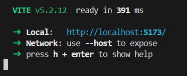
вы увидете подобную запись, http://localhost:5173/ - это ссылка на сайт, доступный только во время работы консоли, чтобы прекратить его работу нажмите ctrl+C

# Анализ содержимого проекта vue
Заглянув в созданную папку, мы увидим
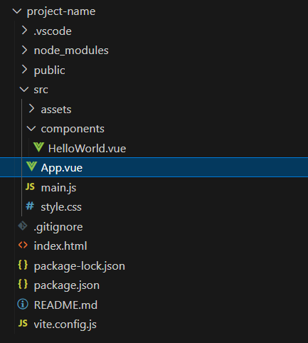
Давайте немного расскажу об этом
### Папка public
используется для добавления каких-то публичных данных, обычно для иконки сайта 
### Папка src
Здесь будут находится главное содержание вашего проекта, а именно
#### Папка assets
Здесь добавляются все изображения, иконки и тому подобные ресурсы
#### Папка components
Здесь будут добавляться ваши компоненты, и я сразу же хочу обсудить этот момент. В среде разработчиков принято писать все понятно и не кидать все яйца в одну корзину, так что, если вы хотите делать большой проект, то начните с прописи иерархии: если у вас есть обширная страница home, то создайте для нее отдельную папку, если в ней есть повторяющиейся код - вынесите его в отдельный компонент и создайте для таких компонетов отдельную папку и тд.
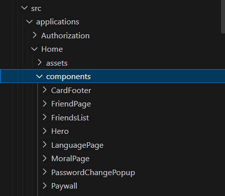
#### Файл App.vue
Это самый высший компонент в древе компонентов, именно в него нужно внедрять остальные компоненты, завязывать логику переключений и маршрутизации
#### Файл main.js
Если посмотреть в него, то все станет ясно
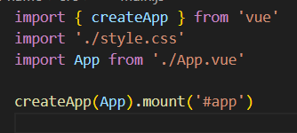
этот файл служит создателем приложения и установщиком глобальных стилей
#### Файл style.css
Является главным и самым верхним набором правил стилей - здесь вы можете задавать переменные, настроить body или добавить условное правило слепой совы

### Файл Package.json
И последним важным для нас этот файл, здесь вы можете поменять имя своего проекта, прописать все зависимости и также посмотреть с помощью каких команд вы можете запустить ваш сайт в браузере(dev) и благодаря какой забилдить проект для дальнейшей выкладки в интерент(об этом мы поговорим в самом конце)

# Основы vue(структура, директивы, реактивые переменные,)
### Структура
Как вы уже могли видеть у нас есть файлы с расширением vue 
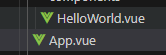
Они и служать для нас сразу html js и css файлами
И для этого они имеют соответсвующие теги
``` js
 <tempate> <script> <style>
```
И для удобства давайте удалим лишний код
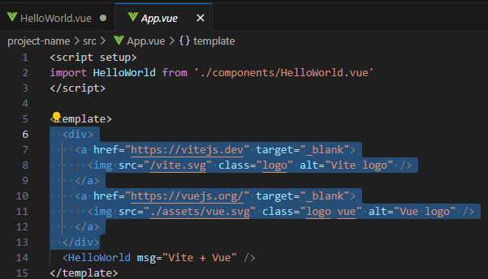
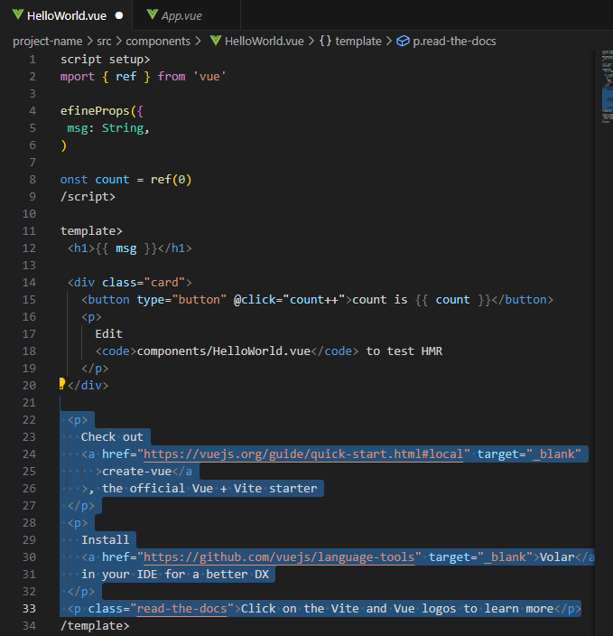
И прожав ctrl+S, вы увидите что ваша страница сразу изменилась

### Директивы
Во vue есть такое понятие как директивы - это аттрибуты в тегах, которые позволяют вносить логику в html часть и свызывать ее с js частью
Вот основные директивы
#### v-if/v-else/v-else-if:
Эти директивы используются для условного отображения элементов.
   - v-if отображает элемент, только если заданное условие истинно.
   - v-else отображает элемент, только если предыдущее v-if ложно.
   - v-else-if отображает элемент, только если предыдущее v-if ложно и заданное условие истинно.
``` js
<div id="app">
  <p v-if="score > 80">Отлично!</p>
  <p v-else-if="score > 60">Хорошо!</p>
  <p v-else>Нужно больше практики.</p>
</div>
```
####  v-show:
   - Директива v-show отображает или скрывает элемент в зависимости от заданного условия.
   - В отличие от v-if, элемент всегда находится в DOM, но просто скрывается с помощью CSS(Становится display: none, что иногда бывает полезно, но если вы можете использовать v-if, то используйте его).
  
``` js
<p v-show="isVisible">Этот текст будет отображаться или скрываться в зависимости от значения isVisible.</p>
```
####  v-for:
   - Директива v-for используется для отображения списка элементов.
   - Она перебирает массив и создает каждый такой же тег на каждый элемент массива.
``` js
   <ul>
     <li v-for="item in items" :key="item.id">{{ item.name }}</li>
   </ul>
```
``` js
     const items= [
         { id: 1, name: 'Яблоко' },
         { id: 2, name: 'Банан' },
         { id: 3, name: 'Апельсин' }
       ]
     };
```

#### v-bind: ( : )
   - Директива v-bind используется для динамического связывания атрибутов HTML-элементов с данными Vue.
   - Она позволяет привязывать переменные js части к атрибутам элементов.
   - Можно писать v-bind: или просто сокращенно :
``` html
   <a :href="url">Ссылка</a>
   
   
```
``` js
const url = 'https://example.com',
const imageUrl = 'https://example.com/image.jpg',
const imageAlt = 'Изображение'

```
#### v-on(@):
   - Директива v-on используется для прослушивания событий на HTML-элементах.
   - Она позволяет связывать обработчики событий с функциями Vue.
   - Имеет сокращенную запись - @
``` html
   <button @click="handleClick">Кликни меня</button>
```
``` js
const handleClick = () => {
  alert('Вы кликнули на кнопку!');
}
```
####  v-model:
   - Директива v-model используется для двустороннего связывания данных.
   - Она позволяет связывать форму ввода данных (input, textarea, select) с данными Vue.
``` html
   <input v-model="message" placeholder="Введите что-нибудь">
   <p>Вы ввели: {{ message }}</p>
```
``` js
 const message = ''
```

### Реактивность
И если вы решите повторить последний пример с v-model: у вас, к сожалению, ничего не получится, о чем это я?
Попробуйте написать так же в HelloWorld.vue
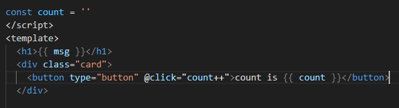
И зайдя на сайт вы увидите, что кнопка перестала работать
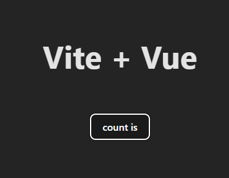
А дело в том, что переменная хоть и инкремируется при каждом нажатии( вы можете это проверить это с помощью console.log())
 но при этом DOM запомнил ее как пустую строку.
 Чтобы это исправить нам нужно добавить Реактивность - способность к обновлению ветви DOM в зависимости от переменной
 Для этого мы должны прописать
 ``` js
 const count = ref('')
 ```
Здесь мы вызываем функцию, которая возвращает объект ref с изначальным значением value = ' '
Не поняли о чем я? Тогда вызовите count с помощью console.log() и увидите
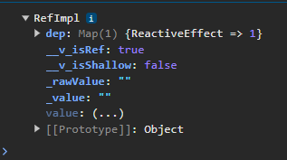

```
Во vue, если мы находимся в script части, то нам приходится добавлять value, чтобы как раз это значение и получить, 
для template же части нам прописывать value не нужно( то же верно и для всех других объектов vue)
```

Как я писал раннее, то, что находится в скобках, - это изначальное значение, то есть мы можем играться с ним как захотим.
К примеру
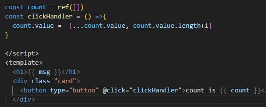
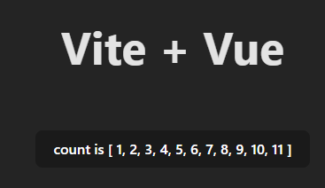

# Компоненты и их взаимодействие
С нынешнимми знаниями вы уже можете писать хорошие лендинги с логикой, но в один момент компонент на 1000 строк покажется неприятным и принцип dry( don't repeat yourself) будет нарушен бесчисленное количество раз. И чтобы избежать этого, мы научимся делать свои компоненты и связывать их логику друг с другом
## Создание собственных компонентов.
На самом деле это делается легче легкого.
Создайте файл с расширением vue в той же папке components, обязательно начните название с большой буквы!
Теперь пропишите три главных тега 
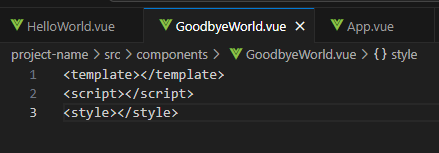
И можете написать немного тегов и логики внутри
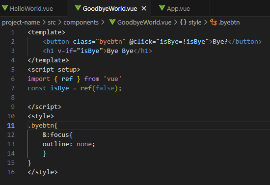
Что-то написав, мы идем в тот компонент, куда хотим внедрить только созданный. И пишем здесь
``` js
import yourComponentName from './yourComponentName.vue' // только не забывайте, что пути к каждому компоненту могут отличаться
```
и после мы можем использовать этот компонент как тег

``` html
  <GoodbyeWorld></GoodbyeWorld>
```
И, поздравляю, теперь вы умеете писать собственные компоненты
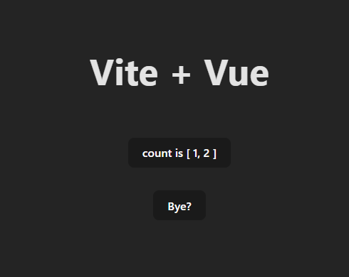
## Передача данных между компонентами с помощью props.
Но просто вставлять компоненты в друг друга это одно дело, а вот объединить их логику совсем другое.
Что делать, если у нас есть кастомный инпут, и нам нужно получать из него данные, или, условно, есть компонент с кнопкой, для которой нужно задавать разные функции?
Решением подобных проблем послужат props. Они выступают как указатели, что компонент будет иметь и что делать.
А для их создания не нужно заморачиваться.
Не смотря на то, что в helloworld, если вы не удаляли, уже есть такая логика, давайте поработаем сами, а именно напишем
GoodBye.vue
``` js
<template  >
    <div v-if="isComponentOpen">
    <button 
     @click="isOpen=!isOpen"> {{isOpen? 'Закрыть' : 'Открыть'}}</button>
    <h1 v-if="isOpen">{{msg}}</h1>
</div>
</template>
<script setup>
import { ref } from 'vue'
const isOpen = ref(false);
defineProps([
  'msg',
  'isComponentOpen' 
])
</script>
```
HelloWorld.vue
```js
<script setup>
import { ref } from 'vue'
import GoodbyeWorld from './GoodbyeWorld.vue'

defineProps(['msg'])

const isOpen = ref(false);
</script>
<template>
  <h1>{{ msg }}</h1>
  <button 
     @click="isOpen=!isOpen"> открыть GoodbyeWorld</button>

  <GoodbyeWorld 
    msg="Я был передан из HelloWorld"
    :isComponentOpen="isOpen"
  ></GoodbyeWorld>

</template>
```
Здесь defineProps() выступает в качестве определителя пропсов, их нужно записывать в массиве в кавычках, если у вас их несколько, то пишите каждый пропс в кавычках и через запятую
Далее, передевать их внутрь компонентов нужно через одноименные атрибуты ``` если defineProps(['msg']) то следовательно msg="..." ```
И на эти аттрибуты так же распространяется правило v-bind
## slot
также есть тег slot, благодаря которому родительские компоненты могут вставлять в дочерние новые теги

GoodBye.vue
``` js
<template  >
    <div v-if="isComponentOpen">
    <button 
     @click="isOpen=!isOpen"> {{isOpen? 'Закрыть' : 'Открыть'}}</button>
    <h1 v-if="isOpen">    
    <slot></slot>
    </h1>
</div>
</template>
```
HelloWorld.vue
```js
<template>
  <h1>{{ msg }}</h1>
  <button 
     @click="isOpen=!isOpen"> открыть GoodbyeWorld</button>
  <GoodbyeWorld 
    :isComponentOpen="isOpen"
  >
<div>ДАННЫЕ ИЗ SLOT</div>
</GoodbyeWorld>
</template>
```
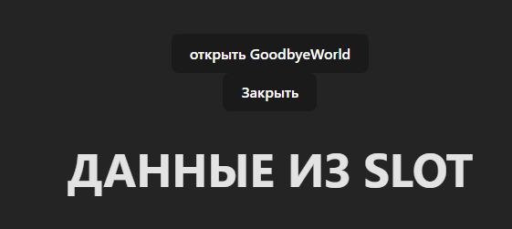